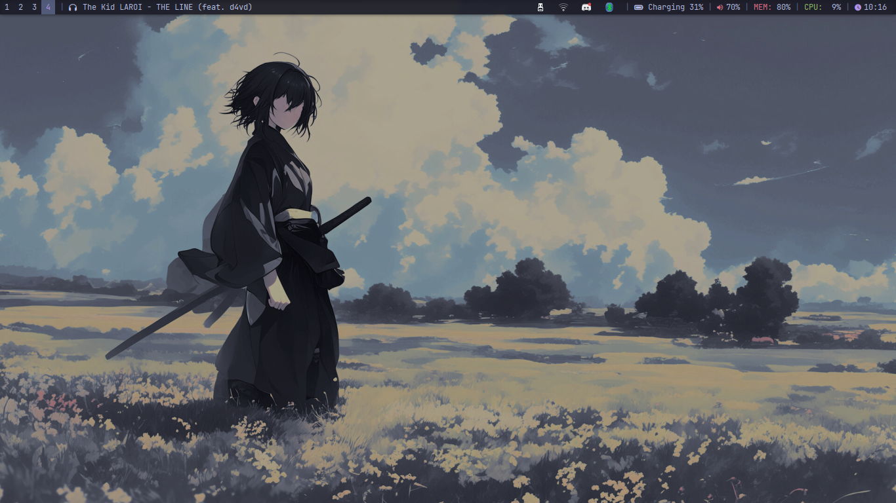
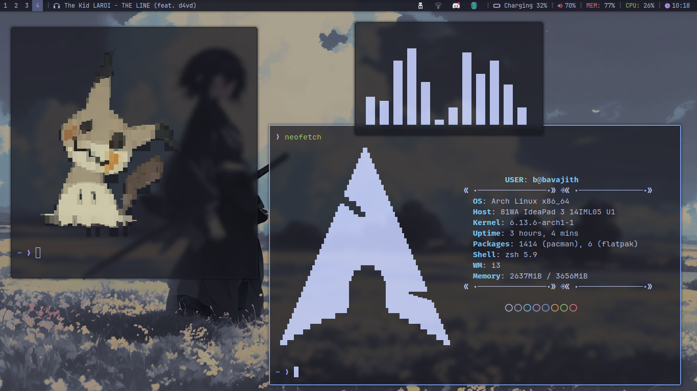

# i3-WM config: Tokyo Night Theme

## Screenshots:

## Major dependencies used:
- Alacritty: A GPU based terminal emulator
- Neovim: A terminal based text editor
- Picom: A compositor for X11
- Polybar: A fancy bar for tiling window managers with custom modules and cool customizibility.
- Ranger: A terminal based File explorer.
- Zathura: A cool and minimal PDF viewer with vim motions. 
